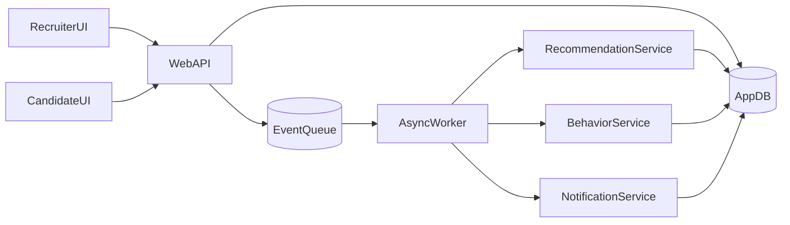
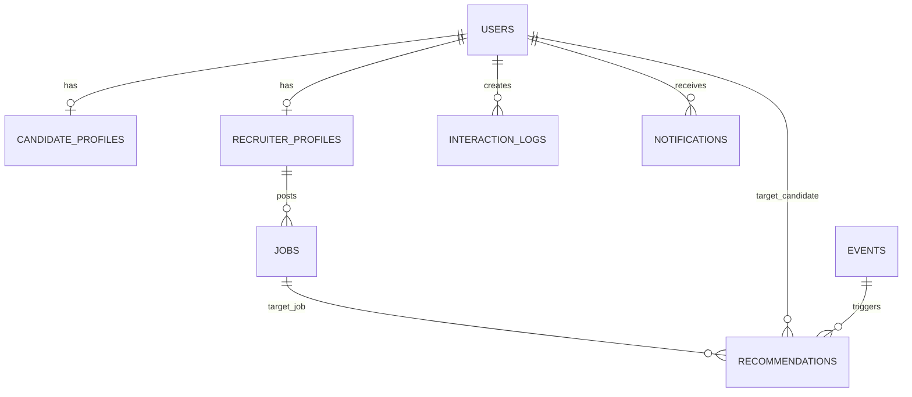
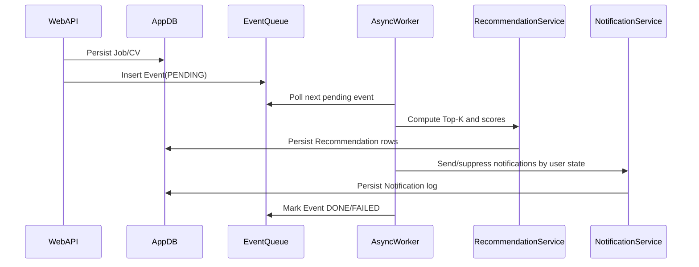

# Architecture, ERD, Event Contracts, and Async Flow

## Logical architecture



## ERD (core entities)



## Event contracts

### `job_created`

- **Producer**: job create API
- **Payload**:
  - `job_id` (int)
  - `recruiter_id` (int)
  - `timestamp` (iso8601)
- **Consumer**: recommendation worker
- **Result**: create top-K candidate recommendations and candidate notifications

### `candidate_profile_updated`

- **Producer**: candidate profile create/update API
- **Payload**:
  - `candidate_id` (int)
  - `profile_id` (int)
  - `timestamp` (iso8601)
- **Consumer**: recommendation worker
- **Result**: create top-K job recommendations and recruiter notifications

## Async processing flow



## Reliability policies

- Retry failed event with capped `retry_count`.
- Mark event `FAILED` after maximum retries.
- Failed events are queryable and can be manually retried through API endpoints.
- Idempotency by deduplicating recommendation rows for same `(job_id, candidate_id, source_event_id)`.
- Suppression policy:
  - `INACTIVE`: no recommendation notifications.
  - `PASSIVE`: optional reduced notification frequency.

## Security and access control

- Authentication model: bearer token from `POST /auth/login`.
- Password storage: PBKDF2 hash.
- Token has expiration time and is invalidated after expiry.
- Login/register endpoints apply in-memory rate limiting.
- Authorization rules:
  - Candidate can only access own profile/feed/activity/interactions.
  - Recruiter can only access own profile/jobs/dashboard.
  - Evaluation and event control endpoints are recruiter-protected.

## Matching Engine — Proficiency-Weighted Skill Vectorization

### Skill Data Model

Each skill carries a **proficiency level** (1-5):

```json
// Candidate skills
[{"name": "python", "level": 5}, {"name": "sql", "level": 3}, {"name": "react", "level": 2}]

// Job required skills (minimum level)
[{"name": "python", "level": 3}, {"name": "sql", "level": 2}]
```

| Level | Meaning |
|-------|---------|
| 1 | Beginner |
| 2 | Elementary |
| 3 | Intermediate |
| 4 | Advanced |
| 5 | Expert |

### Matching Strategies

| Strategy | Vector Type | Proficiency? | How it works |
|----------|-------------|:---:|-------------|
| `proficiency` (default) | Weighted sparse | Yes | `v[i] = level / 5` per skill dimension |
| `gemini` | Dense 768-d | Yes | Gemini Embedding API on proficiency-aware text |
| `tfidf` | TF-IDF sparse | No | scikit-learn `TfidfVectorizer` on skill names |
| `embedding` | Dense 384-d | No | sentence-transformers `all-MiniLM-L6-v2` |
| `set` | Binary | No | Legacy set-intersection cosine |

### Gemini Embedding Strategy

When `MATCHING_STRATEGY=gemini`, skills are converted to natural-language
descriptions that include proficiency context:

```
"advanced python, elementary sql, intermediate react"
```

These are embedded via Google's `text-embedding-004` model (768-d dense vectors).
Cosine similarity is computed in this semantic space, capturing:
- **Semantic proximity** — "django" and "flask" are close even though they're
  different tokens (unlike TF-IDF or set-based approaches)
- **Proficiency context** — "expert python" and "beginner python" produce
  different embeddings, reflecting the proficiency gap

### Proficiency Vector Matching (default)

```
vocabulary = union(candidate_skills, job_skills)
v_candidate[i] = candidate_level[i] / 5    # e.g. Python:5 → 1.0
v_job[i]       = required_level[i] / 5      # e.g. Python:3 → 0.6

similarity = cosine(v_candidate, v_job)
```

Key properties:
- **Same skills, different levels** → similarity < 1.0 (captures proficiency gap).
- **Higher proficiency in matching skills** → higher similarity.
- **Irrelevant skills contribute 0** to the dot product.

### Final Score Formula

```
final_score = w1 × skill_match + w2 × preference_match + w3 × activity_score
```

Where `skill_match = cosine(skill_vector_user, skill_vector_job)` using proficiency weights.

## CV Upload & Auto-Extraction

- Endpoint: `POST /candidates/upload-cv` accepts PDF files.

### CV Parser Modes (`CV_PARSER_MODE`)

| Mode | Behavior |
|------|----------|
| `auto` (default) | Uses **Gemini Vision** if `GEMINI_API_KEY` is set, otherwise regex pipeline |
| `gemini` | Always use Gemini Vision (fails to regex on error) |
| `regex` | Always use the local regex + OCR pipeline |

### Gemini Vision Parser

When a Gemini API key is configured, the system uses **Gemini 2.0 Flash**
(multimodal model) to analyze CV pages as images:

1. PDF pages are rendered to 200 DPI images via `pdf2image`
2. All page images are sent to Gemini with a structured extraction prompt
3. Gemini returns JSON with skills, proficiency levels, experience, locations
4. Gemini can **see and interpret** progress bars, star ratings, pie charts,
   infographics, and all visual elements that text extraction cannot parse

### Regex + OCR Pipeline (Fallback)

| Layer | Technology | When it activates |
|-------|-----------|-------------------|
| 1. Text layer | `pdfplumber` | Always (fast, accurate for text-based PDFs) |
| 2. Proficiency detection | Regex patterns | Always — scans text for numeric/visual indicators |
| 3. OCR fallback | `Tesseract` + `pdf2image` | Only when text layer < 80 chars (image-heavy CVs) |

### Proficiency Detection Hierarchy

For each detected skill, the parser determines proficiency level (1-5) using the first matching method:

1. **Percentage** — `Python 90%` → level 5 (mapped: ≥90%→5, ≥70%→4, ≥50%→3, ≥30%→2, <30%→1)
2. **Fraction** — `React 4/5` → level 4
3. **Unicode visual ratings** — `★★★★☆` → level 4 (supports ★/☆, ●/○, ■/□, ▰/▱)
4. **Keywords** — `Expert in Python` → level 5, `Basic Java` → level 2
5. **Fallback** — level 3 (Intermediate)

### OCR for Image-Based CVs

Many modern CVs use infographic elements (progress bars, charts, icons) that
`pdfplumber` cannot read as text.  When the text layer yields insufficient
content:

1. Each PDF page is rendered to a 300 DPI image via `pdf2image` (Poppler).
2. `pytesseract` (Tesseract OCR) extracts visible text from each image.
3. OCR text is merged with direct text and processed through the same pipeline.

This captures text labels near/inside progress bars, percentage labels rendered
as graphics, and text in scanned/image-only PDFs.

### Extracted Fields

- Skills (148-token dictionary) with **proficiency levels**
- Experience level (keyword + years-of-experience detection)
- Location (30+ Vietnamese and international cities)
- Salary expectations

Auto-populates `CandidateProfile` and triggers `candidate_profile_updated` event for matching.

## Configurability

- Runtime knobs are environment-driven via `app/config.py`:
  - `DATABASE_URL`
  - `MATCHING_STRATEGY` — `proficiency`, `gemini`, `tfidf`, `embedding`, or `set`
  - `GEMINI_API_KEY` — enables Gemini Vision CV parsing and Gemini embedding matching
  - `CV_PARSER_MODE` — `auto`, `gemini`, or `regex`
  - scoring weights `SCORE_W1`, `SCORE_W2`, `SCORE_W3`
  - behavior thresholds/lambda
  - retry and throttle policy

## Operational hardening

- Global exception handlers return unified error schema.
- Audit trail persists key actions (`login`, `logout`, `job_created`, `event_retried`).
- Audit query endpoint: `GET /audit-logs`.
